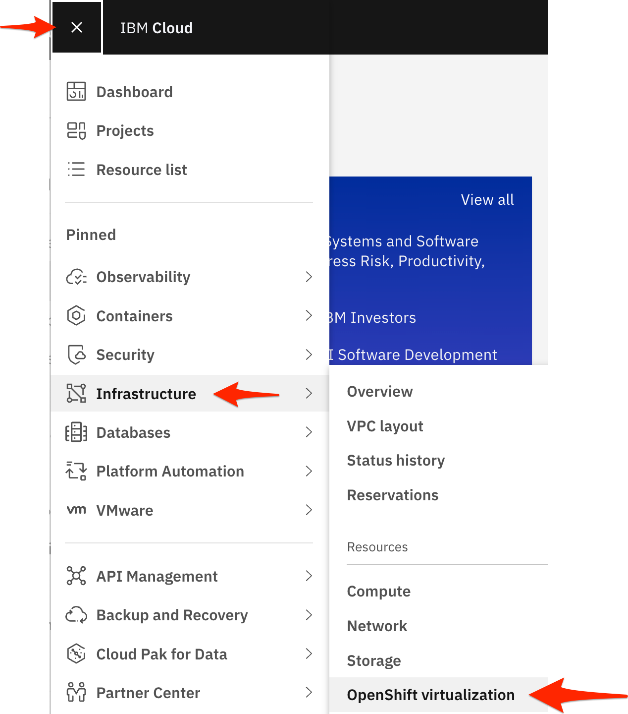
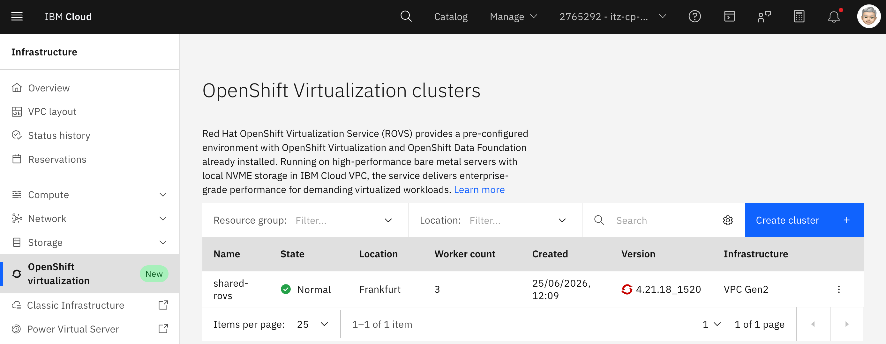
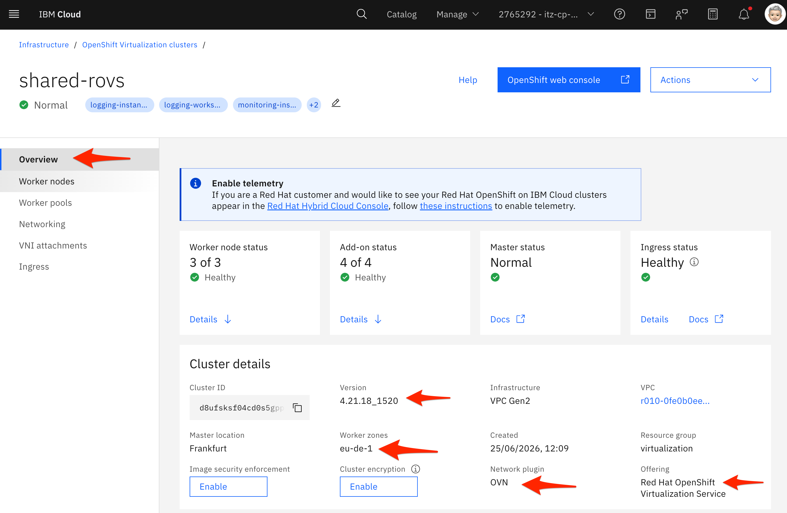
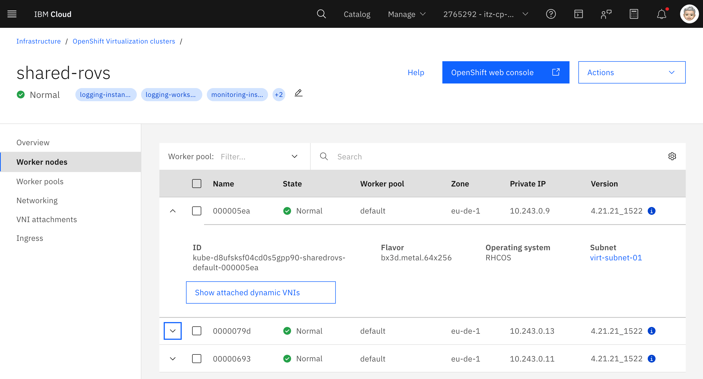
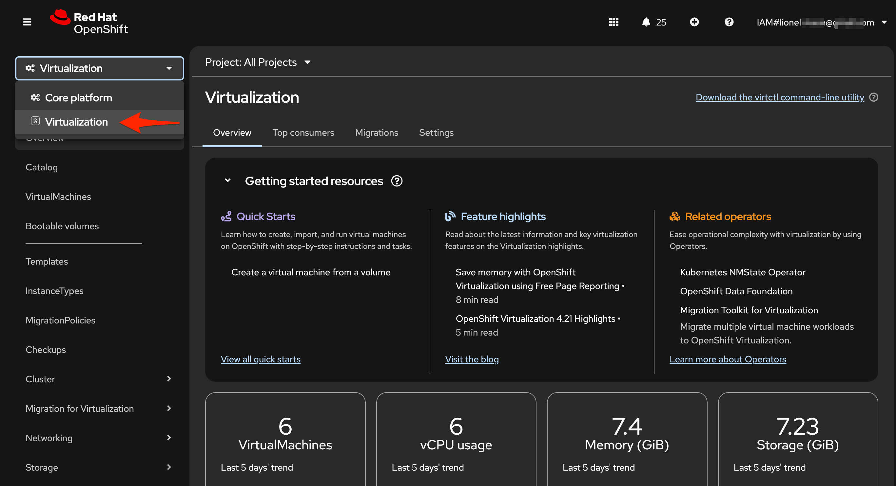
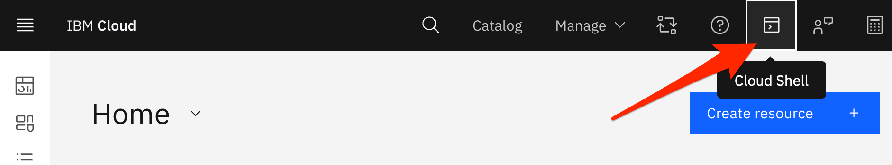
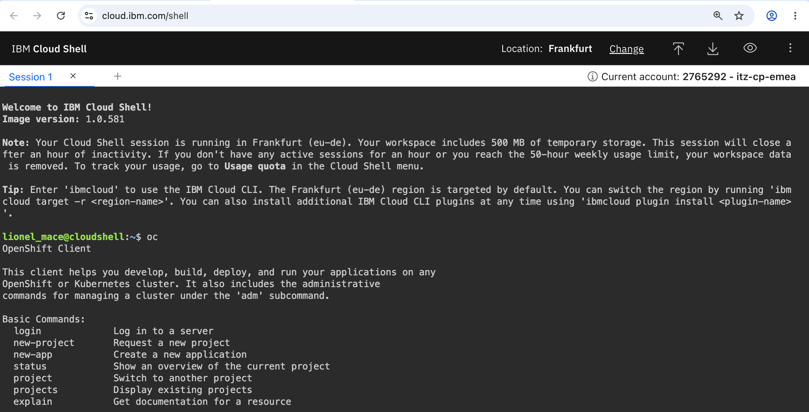
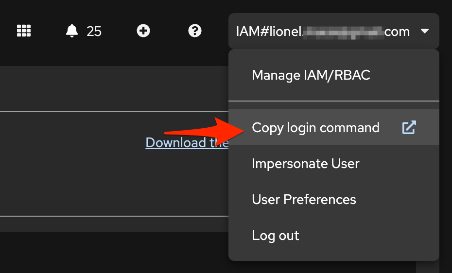
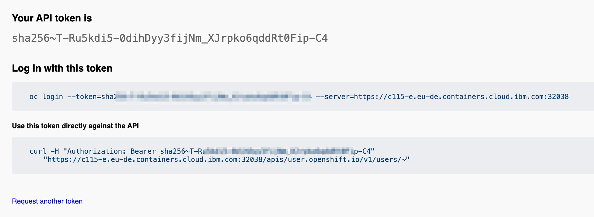
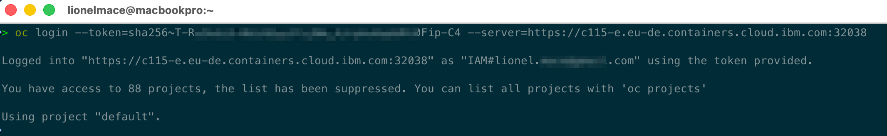

# Access the OpenShift Console

In this section, you will learn how to get access to the ROVS cluster.

## Navigate to the OpenShift Virtualization

1. Go to the [OpenShift Virtualization](https://cloud.ibm.com/infrastructure/openshift-virtualization).

1. You can also access the OpenShift Virtualization from the  menu.

   

1. Find your cluster in the list and click on it.

    

1. Have a look at the cluster overview!

    

    > You can see the cluster version, the region where the cluster is deployed.

1. Notice the network plugin OVN, the default Container Network Interface (CNI) for modern OpenShift clusters. It combines:
    * OVN (Open Virtual Network) – a virtual networking system built on top of Open vSwitch (OVS).
    * Kubernetes integration – providing pod networking, network policies, Services, Egress IP, Egress Gateway, Multus integration, and other advanced networking features.

1. Click on **Worker Nodes** in the left hand side menu.

    

    > Notice: The cluster is composed of 34 worker nodes, each `bx3d.metal.64x256`, which 4 NVMes disks.

1. Click on **OpenShift web console** on the top right to launch the web console.

    

## Connect to OpenShift with the command line (CLI)

To easily connect to the cluster, you need the OpenShift CLI `oc` that exposes commands for managing your applications, as well as lower level tools to interact with each component of your system.

This topic guides you through getting started with the CLI, including installation and logging in.

## Use IBM Cloud Shell

To avoid installing the command line, the recommended approach is to use the IBM Cloud Shell is a cloud-based shell workspace that you can access through your browser.

It's preconfigured with the full IBM Cloud CLI and tons of plug-ins and tools that you can use to manage apps, resources, and infrastructure.

1. In the Console menu bar, click the IBM Cloud Shell [https://cloud.ibm.com/shell](https://cloud.ibm.com/shell) icon to start a session

    

1. A session starts and automatically logs you in through the IBM Cloud CLI.

    

> If you wish to install the OpenShift Command Line on your laptop, you can do so by downloading the correct version from this [page](https://mirror.openshift.com/pub/openshift-v4/clients/ocp/).

## Connect to the OpenShift cluster

1. In the OpenShift web console, click on the email/ID in the upper right. Choose the _Copy Login Command_ option.

    

1. A new page will open with a link **Display Token**. Click this link.

1. Copy the log in with this token line.

    

1. In the Cloud Shell or your terminal, paste the `oc login` command you copied in the previous step.

    

Your CLI is now connected to your OpenShift cluster running in IBM Cloud.

## Validate cluster access using `oc` commands

1. View projects

    ```bash
    oc get projects
    ```

1. Make sure you're connected to your project

    ```bash
    oc project <name-of-your-project>
    ```

    > Your project name starts with `vm-` and includes your last name.

You've completed the getting started! Let's recap -- in this section, you:

You connected your local CLI to a running OpenShift cluster on IBM Cloud.
