# Virtual Machine Management

## Introduction

The beginning section of this lab will introduce you to the basics of creating and managing VMs in OpenShift Virtualization. Starting with OpenShift 4.18 there is a new Virtualization persona and a tree view for virtual machines that make it easier to visualize and manage your virtualization-based assets. After exploring the UI changes, you will see how the web console guides you through the whole process of creating a virtual machine from a pre-defined template. We will then review the properties of that VM, do some basic customizations, and perform actions like live migration, that are often expected of virtual machine administrators.

### Goals

- Create a new virtual machine
- Review and modify resources for virtual machines
- Understand how VM power states are managed using the OpenShift console
- Live migrate a VM between two hosts

As a reminder, here are your credentials for the OpenShift Console:
The link to the OpenShift cluster console can be found in the invite or in the details of the "virt-roks" cluster in the container section of the IBM itz-cp-emea cloud account.

If things are correct you came here since you were invited as a member of the shared ITZ account “2765292 – itz-cp-emea” to be able to demo the “Virtualization on OpenShift Sales Play”
Your login is available through SSO using your IBM id: name@xx.ibm.com

### Switch to the Virtualization Persona

- When you first log in, you will be placed in the Administrator persona.

    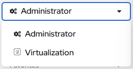

- Now, click on Administrator in the upper left corner and switch to the Virtualization persona.

> The Virtualization persona is available only when Red Hat OpenShift Virtualization is installed and properly configured. In this lab environment the installation and configuration has already been performed for us.

- In a fresh environment you will be greeted by an introductory prompt welcoming you to OpenShift Virtualization. Since this environment has been prepped already you will not see this greeting.

## Exploring OpenShift Virtualization

1. When you arrive in the Virtualization view you will be on the Overview page which provides a high-level view of all virtualization resources currently in use, lets take a moment to explore.

    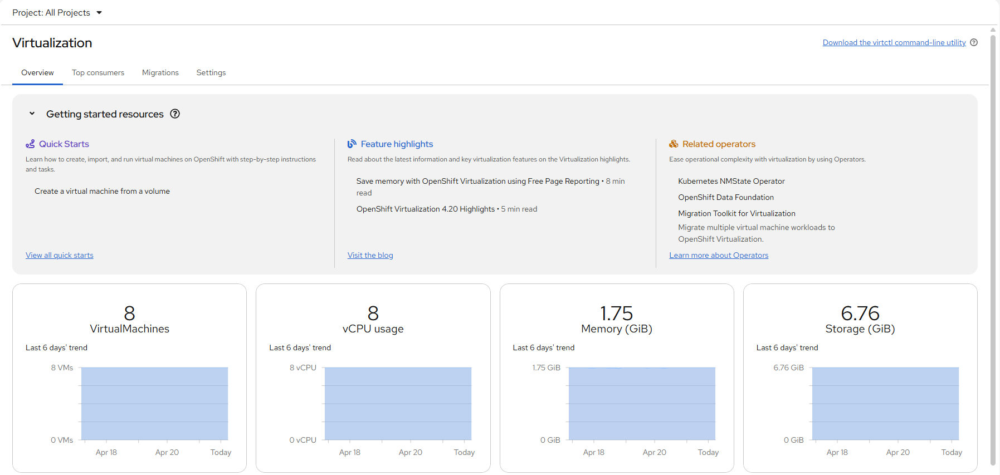

1. Click on the VirtualMachines item in the left side menu and you will be presented with the virtualization tree view of all VM assets.

    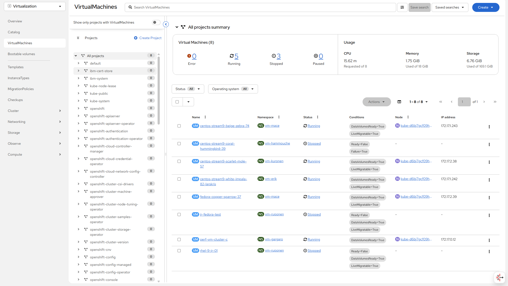

1. Lets explore this page for a few moments: notice that this view is divided into 3 columns, the left-side management menu, the central column for organization of vm-imagebased projects, and then the virtual machine view.

1. The left menu is the main control for Virtualization integrated functions in OpenShift. We can see virtualization related items like the Catalog, Templates and InstanceTypes to build VMs from, and the menus to configure Storage and Netoworking for virtual machines.

    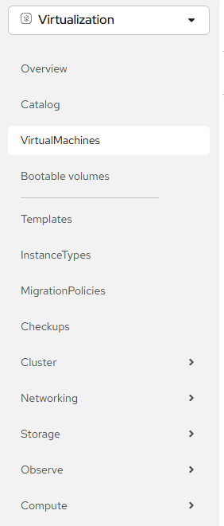

1. The central column as mentioned is a project view. Like other objects in OpenShift, Projects (which are an abstraction for Kubernetes namespaces), are the boundaries for which permissions and other aspects of using and managing the resources are available to a user. By default there is a slider here that only shows projects with existing VMs. This environment has been prepped for demo purposes. When you request access after invitation to the environment, a project “vm-image*your-family-name*” was created as part of the process. Make sure to select your newly created OpenShift Project “vm-image*your-family-name*” when creating VM’s.

1. Find the created projects in the project view.

    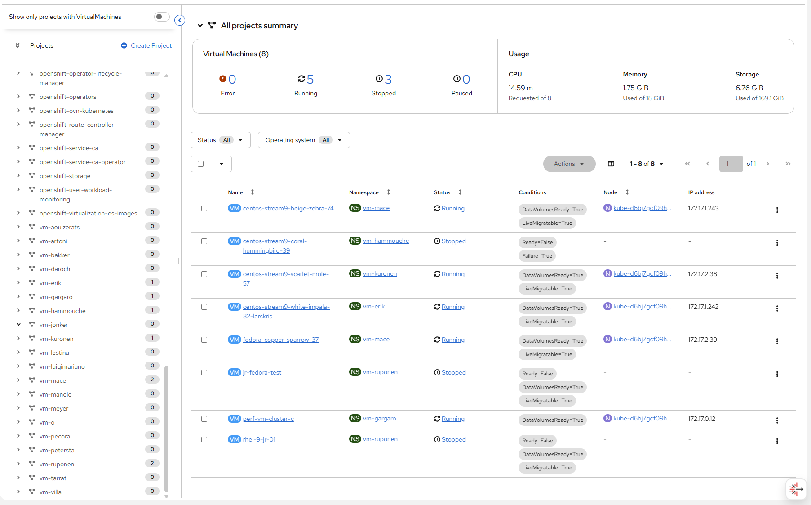

1. In the virtual machine overview column, it will list All projects by default, which shows us the VM’s for every user in our shared cluster environment. You can sort by columns to make locating VM’s easier, or even arrange which columns are visible to make organization easier. This view will change when you highlight a specific project or virtual machine in the center column.

    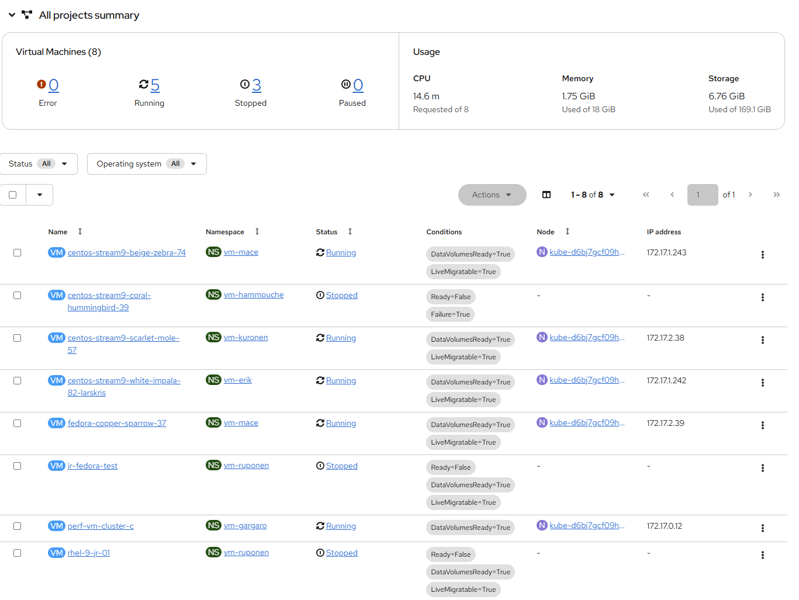

1. From the center column click on the project “vm-imageyour-family-name” to see the virtual machines that are currently deployed and available to your specific user account.

    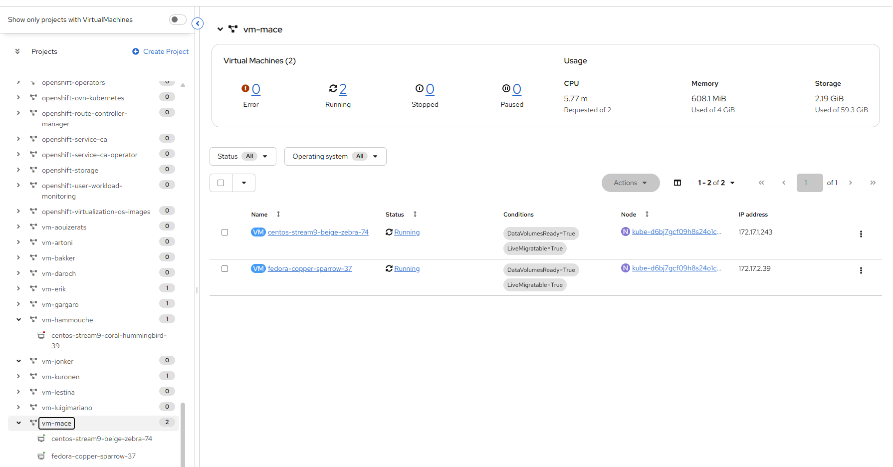

> While the lab guide is configured to be dynamic and show your specific user account and project names whenever possible, the images in the lab guide are static and may show a different user, please perform these tasks in reference to your own user account and associated projects.
- The virtual machine overview column will update to only show the virtual machines in the “vm-*your-family-name*” project. You should see no VMs listed.

    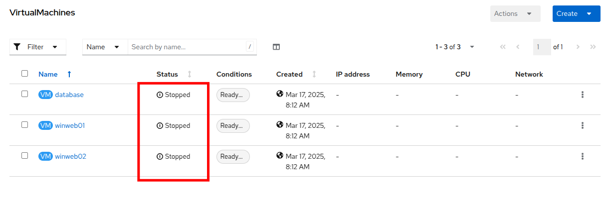

### How to Create a New Project

This is only to demo the creation of a project!! Do not create a project but after this use the project created for you.

1. Before creating a VM we need to create a new project. Virtual machines are deployed to a specific project, or namespace, where by default, users without permission to the namespace cannot access, manage, or control them. Administrators can access all projects, and therefore view all virtual machines, however regular users must be given access to projects as needed.

1. Click Create Project at the top right of the center tree view column.

    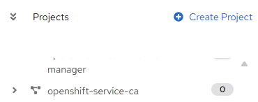

1. In the Name field, type vmexamples-user1 to name the project, then (DO NOT) click Create.

    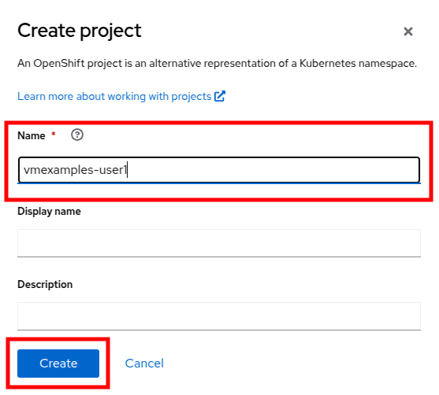

## Create a Linux Virtual Machine

1. From the virtual machine overview column, click on the Create VirtualMachine button and select From template from the drop-down menu.

    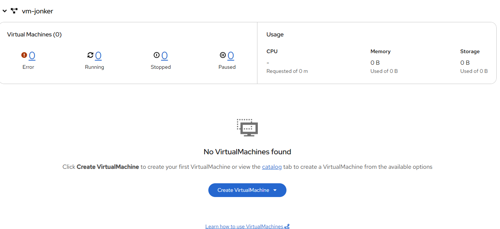

VMs can also be created from an InstanceType wizard as well as created by entering a custom YAML definition, but for this current lab scenario we are going to stick with creating VMs based on existing templates.

1. You will be taken to the Catalog screen, where a number of tiles will appear showing the available pre-defined VM templates.
Reviewing the list of available templates you’ll notice that some have a blue badge which indicates Source available. These are templates which are using automatically downloaded and stored template source disks.
If you were deploying in your own environment where you can customize the options available, you can choose to modify the availability of these boot sources by default, and/or remove these source disks, in favor of creating custom disks for your organization’s needs.

    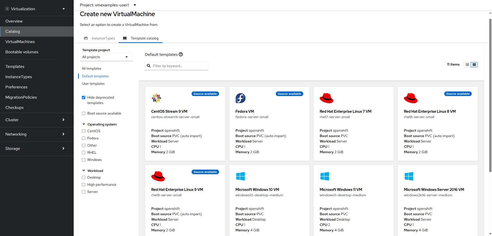

1. Select the Fedora VM tile, and a dialog opens.

    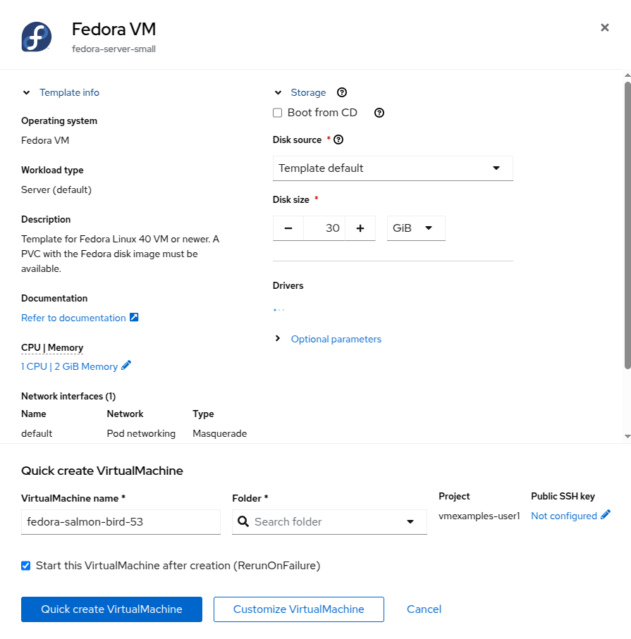

1. Change the name to fedora01 and press Quick create VirtualMachine.

    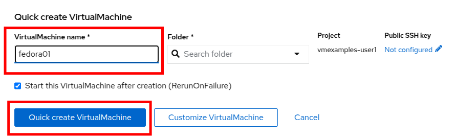

1. We will return to our tree view and see information about our new VM in the virtual machine overview column. Notice also that we now see our vmexamples-user1 project listed in the center column as it contains a VM, and that it is highlighted within the project.
If we watch closely we can see the VM Status switch from Provisioning to Starting and finally Running in the virtual machine overview column when it is ready.
During this time, the storage provider has cloned the template disk so that it can be used by the newly created virtual machine. The amount of time this takes can vary based on the storage provider being used to create the boot disk, and the current load on the system.

    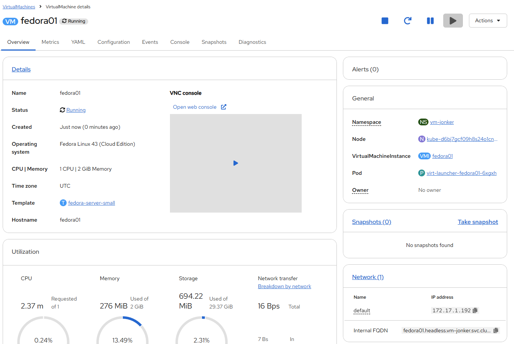

1. Once the virtual machine is running we can do some further exploration of the Overview page in the right side column.

- Details: This tile shows us information about our VM, including it’s name, status, creation time, OS, virtual resources, and the template from which it was created. It also contains a minature VNC terminal, and the ability to launch a fullscreen web console.
- General: This tile shows us information specific to OpenShift, including the Namespace (Project), instance name, and Kubernetes pod where the guest is running.
- Snapshots: This tile gives us information about any existing snapshots, and also has the button to quickly create a snapshot.
- Network: This tile gives us the IP address of the virtual machine on the software-defined network (SDN) and it’s internal hostname. If no advanced networks are defined, VMs are automatically attached to the pod network. Later in this lab we will explore advanced networking options, and how to customize connectivity for VMs.
- Utilization: This tile gives us an overview of the resources currently in use by this virtual machine, including CPU, Memory, Storage, and Network throughput.

    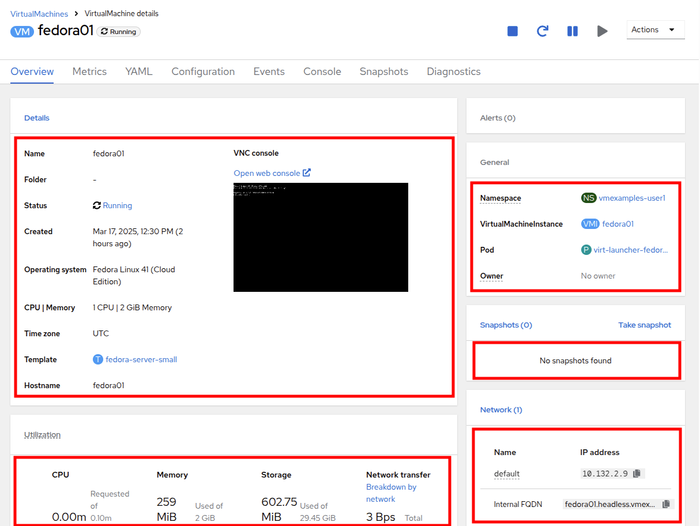

1. After you are done looking at the VM details, click the Events tab to see some details of the provisioning process that just took place. If there are any issues with the creation of the VM, they will show up on this tab as well. The following events took place during creation:

    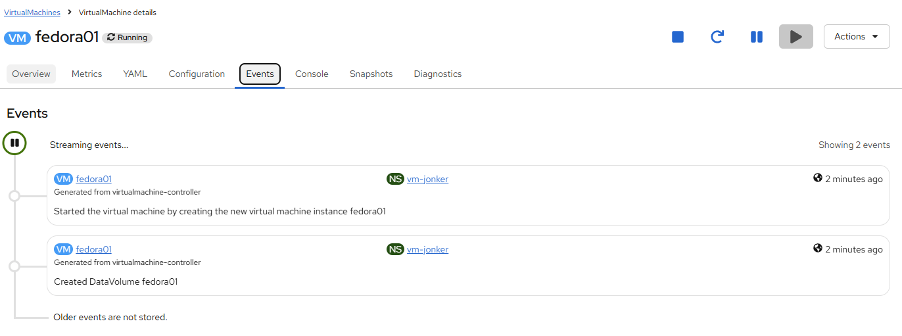

- A DataVolume was created. DataVolumes are used to manage the creation of a VM disk, abstracting the clone or import process onto OpenShift native storage during the virtual machine’s creation workflow.
- The new VM instance Fedora01 has been started.

## Administering Virtual Machines

Administering and using virtual machines is more than simply creating and customizing their configuration. As the platform administrator, we also need to be able to control the VM states and trigger live migrations so that we can balance resources, perform maintenance tasks, and reconfigure nodes.

1. Click the Configuration tab, this is the entry point to obtain more information about, and modify the resources of the virtual machine.

    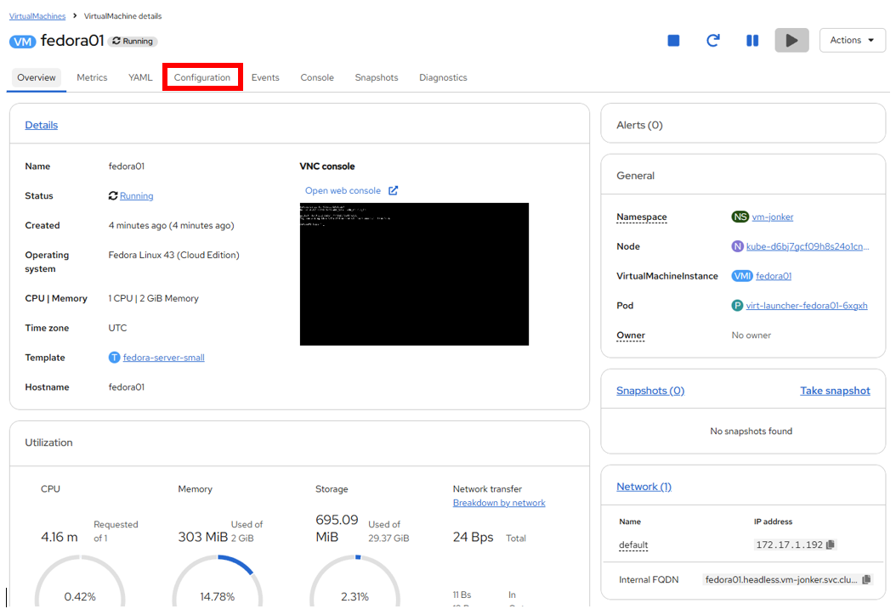

    It includes seven subtabs:

    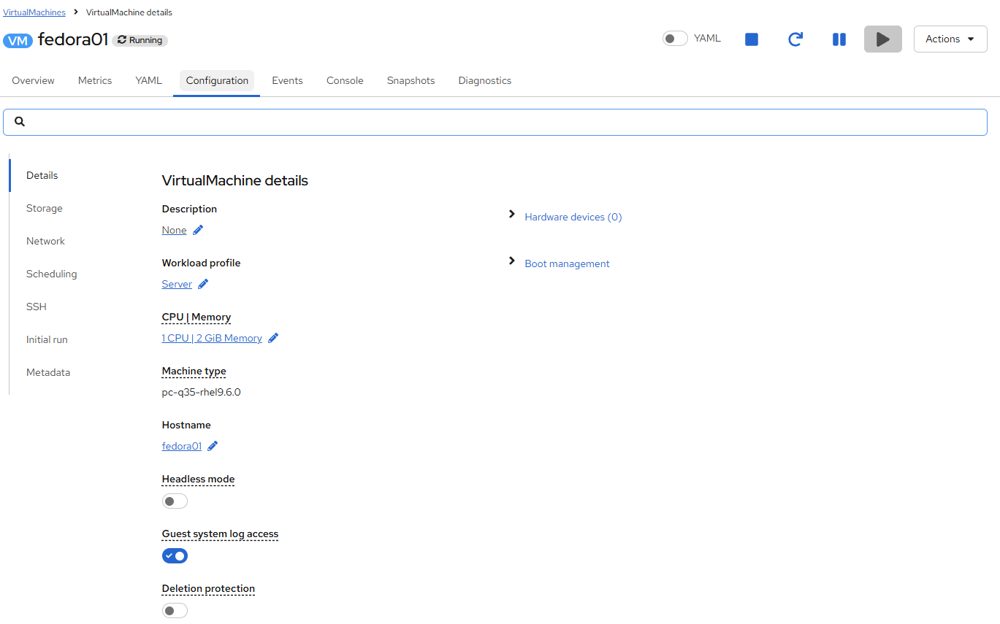

- Details: This tab presents all of the physical features of the VM in a single panel. From here you can make edits to various descriptors and basic hardware configurations including modifying the cpu or memory, changing the hostname, attaching passthrough devices, and modifying the boot order.
- Storage: This tab lists the disks attached to the system and allows you to add new disks to the system. If the guest is configured with the agent, it lists the filesystems and the utilization. Here it is possible to attach ConfigMaps, Secrets, and Service Accounts as extra disks. This is useful when passing configuration data to the application(s) running in the virtual machine.
- Network: This Tab shows the current network interfaces configured for the VM and allows for you to add new ones.
- Scheduling: This tab includes advanced configuration options indicating where the VM should run and the strategy to follow for eviction. This tab is used to configure (anti)affinity rules, configure node selectors and tolerations, and other behaviors that affect which cluster nodes the VM can be scheduled to.
- SSH: This tab allows you to configure remote access to the machine by creating an SSH service on a configured load-balancer, or by injecting public SSH keys if the feature is enabled.
- Initial run: This tab allows us to configure cloud-init for Linux or sys-prep for Microsoft Windows, including setting the commands to be executed on the first boot, such as the injection of SSH keys, installation of applications, network configuration, and more.
- Metadata: This tab shows current Labels and Annotations applied to the virtual machine. Modifying these values can help us tag our machines for specific purposes, or help us enable automated workflows by uniquely identifying machines.
- You can click on each of these to explore at your leisure, but for introductory purposes, lets focus on storage and networking specifically.
- List the disks associated with the VM by clicking on the Storage tab:

    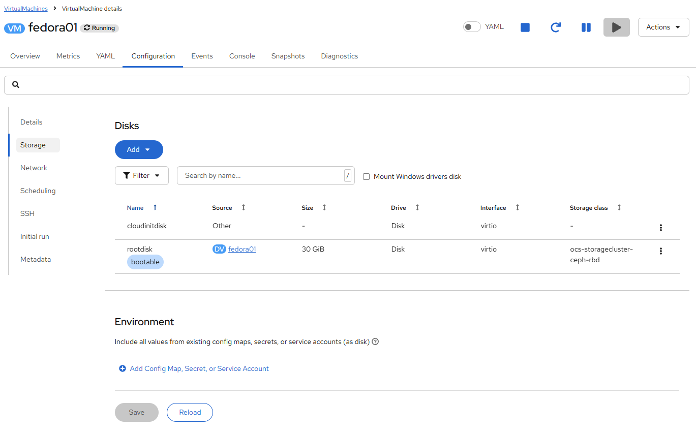

In this environment, the default StorageClass, which defines the source and type of storage used for the disk, is called ocs-storagecluster-ceph-rbd. This storage is the default type provided by OpenShift Data Foundation (ODF) for running virtual machines. Each storage provider has different storage classes that define the characteristics of the storage backing the VM disk.

> @@@@@ add a link here to the demo script “Storage management” #LMA

1. Examine the network interfaces attached to the VM by clicking on the Network subtab:

    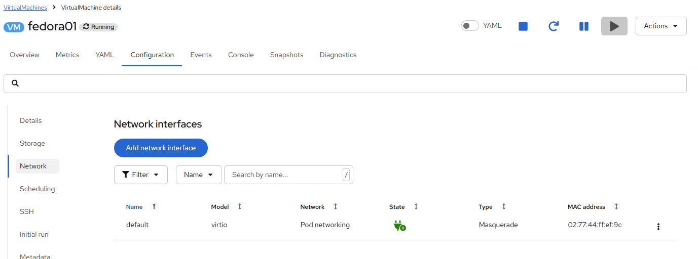

When a VM is created, an interface on the Pod Networking network of type masquerade is created by default. This connects the VM to the SDN and provides access from the VM to outside the OpenShift cluster. Other VMs, and Pods, in the cluster can access the virtual machine using this interface.
Furthermore, a VM connected to the SDN can be accessed externally using a Route, or Service with type load balancer, or even have a Network Attachment Definition configured to allow direct access to external networks, a concept we will explore in more depth later.
> @@@@@ add a link here to the demo script “Networking management” #LMA

## Controlling Virtual Machine State

As a user with granted permissions to manage a Virtualization environment: you can stop, start, restart, pause, and unpause virtual machines from the web console.

1. Click the Overview tab to return to the summary screen.

1. In the top right corner you will notice shortcut buttons for running state: stop, restart, pause, and start. As well as a dropdown menu title Actions.

    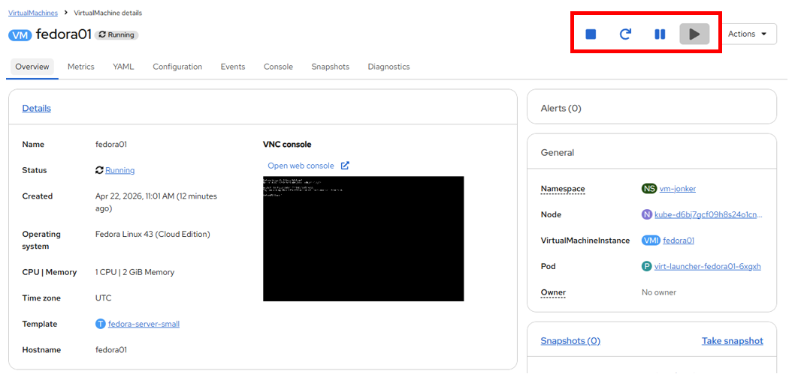

- Stop: Starts a graceful shutdown of the Virtual Machine.
- Restart: This will send a signal to the operating system to reboot the Virtual Machine. Guest integrations are needed for this to work properly.
- Pause: The process is frozen without further access to CPU resources and I/O, but the memory used by the VM at the hypervisor level will stay allocated.
- Start: Starts up a stopped virtual machine. It will be greyed out if the machine is running.
- While the shortcut buttons are handy, you can also access these options and more by clicking on the Actions menu and seeing the options available in the drop down list.

    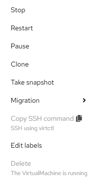

1. Press the Stop button and wait until the Virtual Machine is in state Stopped.

    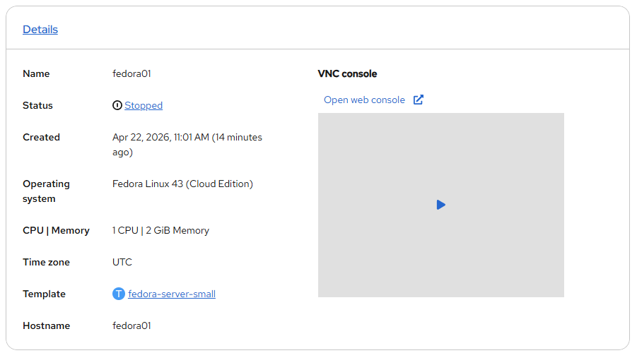

1. Clicking on Actions, the option Start appears, and the options Restart and Pause are greyed out.

    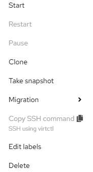

1. Click Start, and wait for the Running status.

- Using the Actions menu, or the shortcut button, press the Pause option. The Virtual Machine state will change to Paused.

    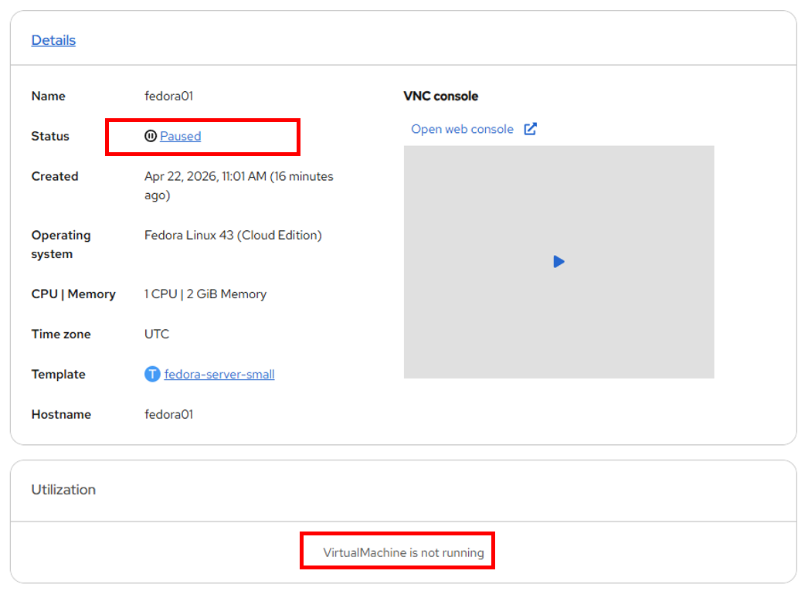

1. Unpause the Virtual Machine using the Actions menu and the option Unpause, or by using the shortcut button.

## Live Migrate a Virtual Machine

In this section, we will migrate the VM from one OpenShift node to another without shutting down the VM. Live migration requires ReadWriteMany (RWX) storage so that the VM disks can be mounted on both the source and destination nodes at the same time. OpenShift Virtualization, unlike other virtualization solutions that you may be familiar with, does not use monolithic datastores mounted to each cluster member that hold many VM disks for many different VMs. Instead, each VM disk is stored in its own volume that is only mounted when and where it’s needed.

1. To see the physical node that the virtual machine is running on, click on the Pod name virt-launcher-fedora01-uuid found under the General tile on the Overview page.

    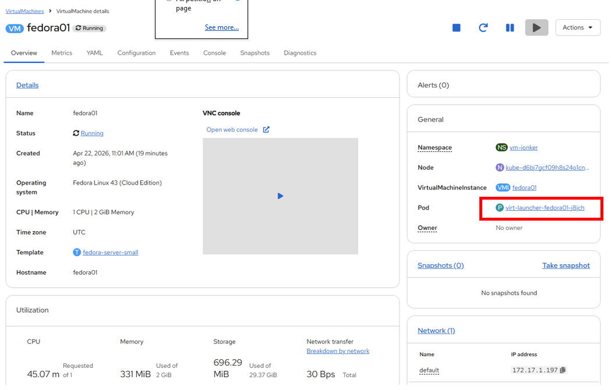

- This will bring up the Pod details page. Search for the section header called Node and see the name of the worker that the pod is running on. In this screenshot it is running on kube-d6bj7gcf09h8s24o1cng-virtroks-pool2cx-000012b5.

    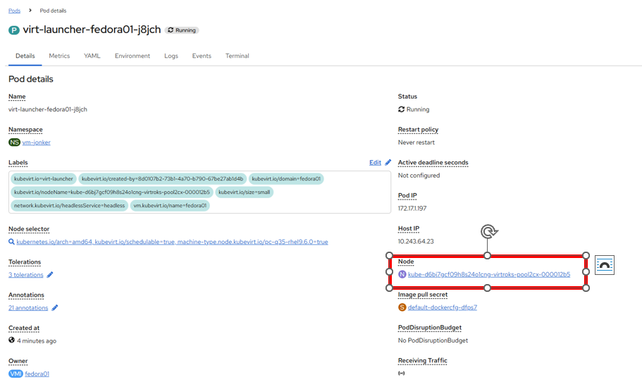

1. Click the back button in your browser to return to the Overview page.

- Using the Actions menu, select the option for Migration → Compute.

    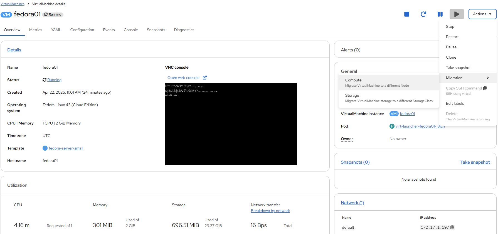

1. Select “Automatically select the node” and select “Migrate Virtualmachine”

    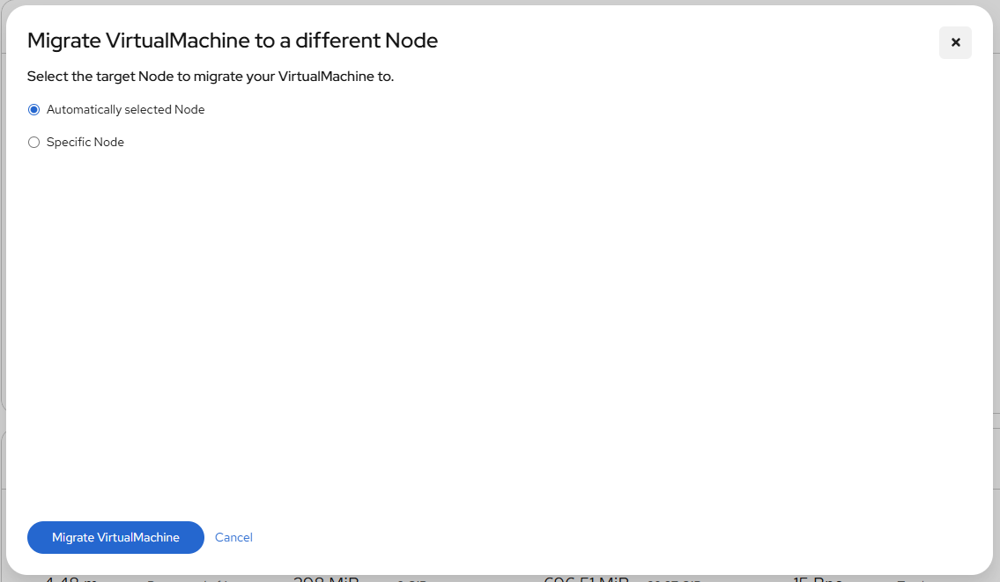

- After a few seconds, the VM will change the status to Migrating, and you can follow it’s progress.
- When the migration is complete the VM will return to the Running status, but it will be living on a new node. Let’s click on our virt-launcher-fedora01-9jn2r pod name to verify.

    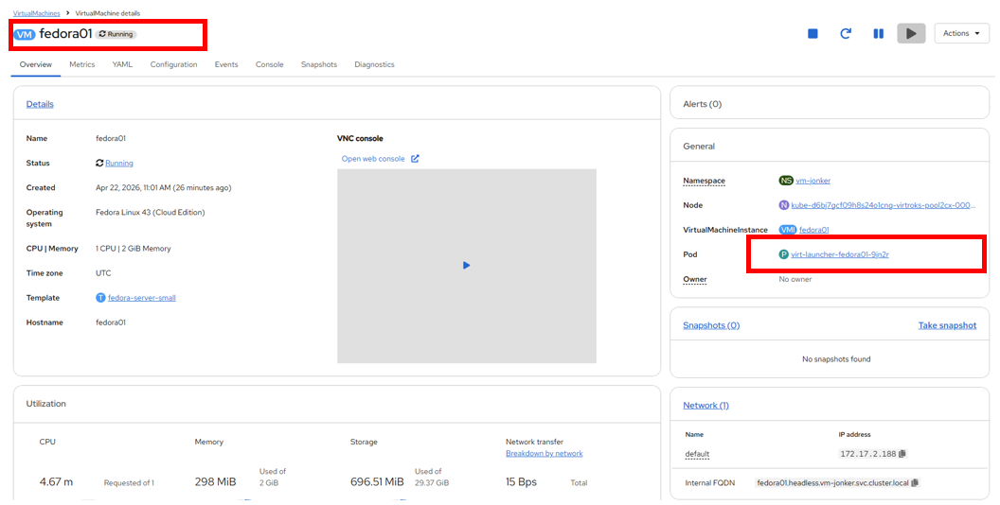

- We can now see that the virtual machine is living on a new node, in the image kube-d6bj7gcf09h8s24o1cng-virtroks-pool2cx-000013e7, and that the pod itself now resides in a new pod with a new unique ID as the live migration process transfers the VM instance to a new pod on a new worker node nondisruptively.

    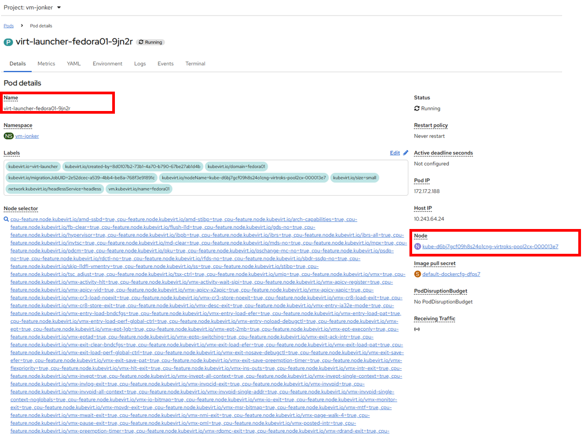

## Summary

In this lab, we did an overview of the Virtualization management environment in OpenShift Virtualization, and performed some basic virtual machine management tasks, including state management and live migration between physical hosts. Both of these are common and often necessary tasks as platform administrators and a great way to familiarize yourself with some basic features available when working with VMs in OpenShift Virtualization.
