# Table of Contents {#table-of-contents .TOC-Heading}

[Storage Management [1](#storage-management)](#storage-management)

[Script Start [1](#script-start)](#script-start)

[Examine the PVC for a VM
[2](#examine-the-pvc-for-a-vm)](#examine-the-pvc-for-a-vm)

[Managing Snapshots [3](#managing-snapshots)](#managing-snapshots)

[Clone a Virtual Machine
[11](#clone-a-virtual-machine)](#clone-a-virtual-machine)

[Summary [16](#summary)](#summary)

# Storage Management

Before you run through this script, the advice is to scroll through the
deep dive presentations and recordings you can find in this github:

- Introduction to ROKS-ROVE

- Deeper Dive Compute

- Deeper Dive Storage

- Deeper Dive Networking

- Deeper Dive Backup

- Deeper Dive DR

- Deeper Dive Observability

Note: deep dives created and presented by Neil Taylor and Sami Kuronen

OpenShift Virtualization on IBM Cloud at this time (April 2025) does not
support all types of storage. The script is written in the general
context of Red Hat OpenShift Virtualization and will not discuss the
specifics of what is supported in IBM Cloud. We strongly advise you to
watch the storage deep dive to learn the specifics of OpenShift
Virtualization on IBM Cloud

## Script Start

Red Hat OpenShift supports multiple types of storage, both for
on-premises and cloud providers. OpenShift Virtualization can use any
supported container storage interface (CSI) provisioner in the
environment where your workload is running.

Some physical storage system examples include: Dell/EMC, Fujitsu,
Hitachi, NetApp, and Pure Storage.

Some software-defined storage examples include: IBM Fusion Data
Foundation, OpenShift Data Foundation (ODF), and Portworx.

  ---------------------------------------------------------------------------------------------------------------------
     This list is not exhaustive, please see the [Red Hat EcoSystem
     Catalog](https://catalog.redhat.com/platform/red-hat-openshift/virtualization#virtualization-infrastructure) for
     information on all of the supported storage solutions.
  -- ------------------------------------------------------------------------------------------------------------------

  ---------------------------------------------------------------------------------------------------------------------

This workshop segment will explore Persistent Volume Claims (PVCs),
which are used to request storage from the provider and store a VM disk.
Many storage providers also support snapshots and clones of their
devices, be sure to check with your vendor to verify the features
supported by the CSI driver and storage device.

Notably, there are no restrictions on storage protocol (e.g. NFS, iSCSI,
FC, etc.) specific to OpenShift Virtualization. The only request is that
the RWX access mode is available, as it is required to support live
migration of VMs within the cluster. Otherwise, the right choice for
storage is that which best meets the needs of your organization's VMs
and Applications.

Please observe the following graphic for a demonstration of the CSI
workflow for provisioning storage in Red Hat OpenShift.

{width="6.268055555555556in"
height="3.2625in"}

## Examine the PVC for a VM

In this lab, we are going to take a closer look at the storage behind
the virtual machine we just created fedora01.

1.  Start by clicking on the left menu for Storage → Persistent Volume
    Claims. Make sure you are in the vmexamples-user1 namespace, you
    should see the fedora01 PVC that was created when you created
    the fedora01 VM in the previous section.

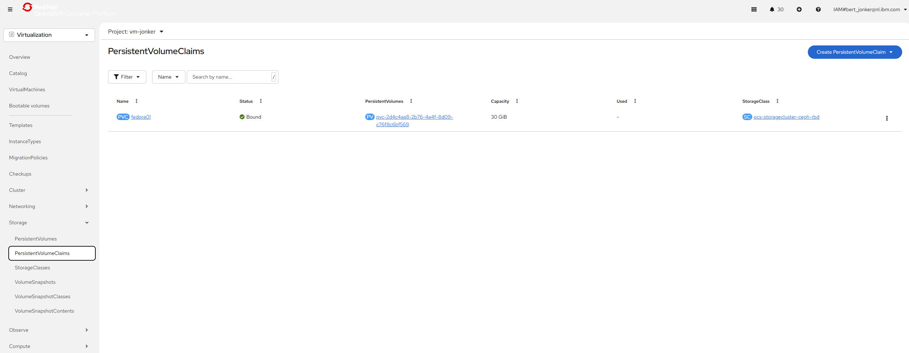{width="6.268055555555556in"
height="2.438888888888889in"}

2.  Click on the fedora01 PVC and you will be presented with a screen
    that shows additional details about the storage volume backing the
    VM.

3.  Notice the following information about the persistent volume claim:

    a.  The PVC is currently bound successfully

    b.  The PVC has a requested capacity and size of 30GiB

    c.  The Access mode of the PVC is ReadWriteMany (RWX)

    d.  The Volume mode of the PVC is Block

    e.  The volume is using
        the ocs-external-storagecluster-ceph-rbd storage class.

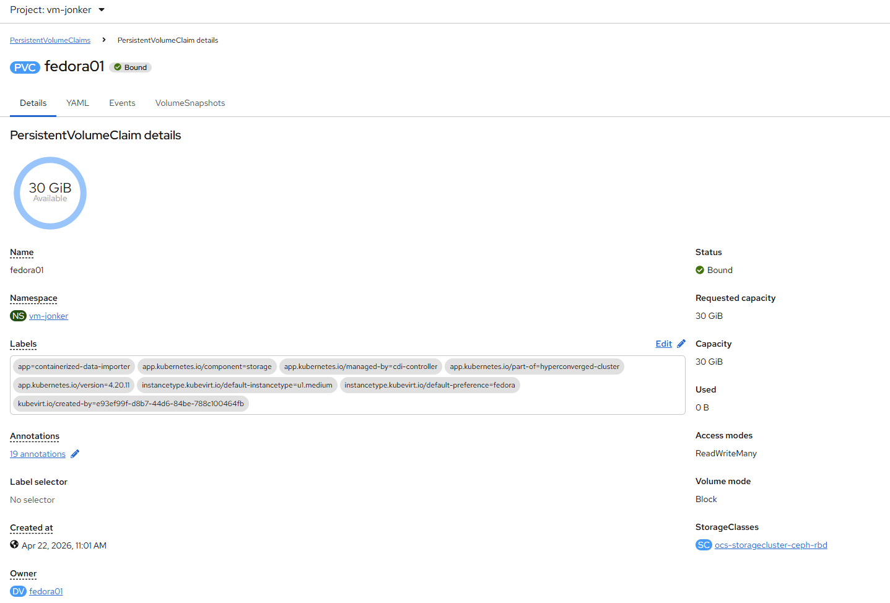{width="6.268055555555556in"
height="4.248611111111111in"}

## Managing Snapshots

OpenShift Virtualization relies on the CSI storage provider's snapshot
capability to create disk snapshots for the virtual machine, which can
be taken \"online\" while the VM is running, or \"offline\" while the VM
is powered off. If the KVM integrations package (qemu-tools) is
installed on the VM, you will also have the option of automatically
quiescing the guest operating system (quiescing ensures that the
snapshot of the disk represents a consistent state of the guest file
systems, e.g., buffers are flushed and the journal is consistent).

Since disk snapshots are dependent on the storage implementation,
abstracted by the CSI, both the performance impact and capacity used
will depend on the storage provider. Work with your storage vendor to
determine how the system will manage PVC snapshots and the impact they
may or may not have on your expected performance.

  -------------------------------------------------------------------------
     Snapshots, by themselves, do not provide a backup or disaster recovery
     capability as they are usually stored locally on the same storage
     system as the original physical volume. To survive a true disaster,
     the data would still need to be protected in other ways, such as
     having one or more copies stored in a different location, or mirrored
     to a storage system at a remote location to overcome the storage
     system itself failing.
  -- ----------------------------------------------------------------------

  -------------------------------------------------------------------------

With the VM snapshots feature, cluster administrators and application
developers can:

- Create a new snapshot

- List all snapshots attached to a specific VM

- Revert a VM to a snapshot

- Delete an existing VM snapshot

Creating and Using Snapshots

1.  Navigate back to Virtualization persona dropdown, and then click
    on VirtualMachines in the left-side menu. Expand the
    project vmexamples-user1 in the center column and highlight
    the fedora01 virtual machine.

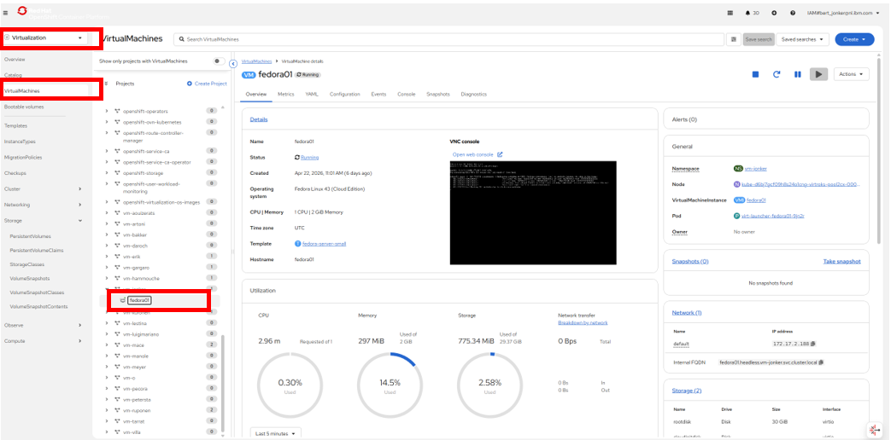{width="6.268055555555556in"
height="3.1006944444444446in"}

2.  Notice there are currently no snapshots of this VM listed on the
    overview page.

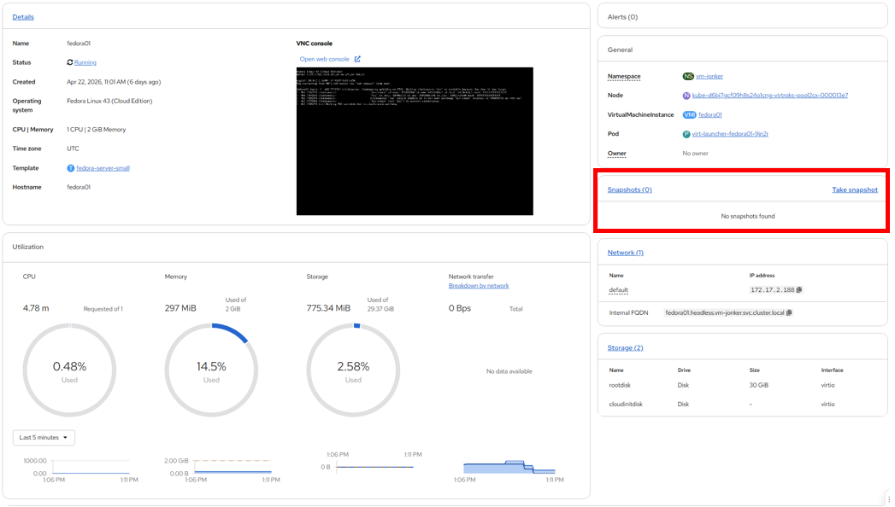{width="6.268055555555556in"
height="3.55625in"}

3.  Navigate to the Snapshots tab at the top of the page.

------------------------------------------------------------------------

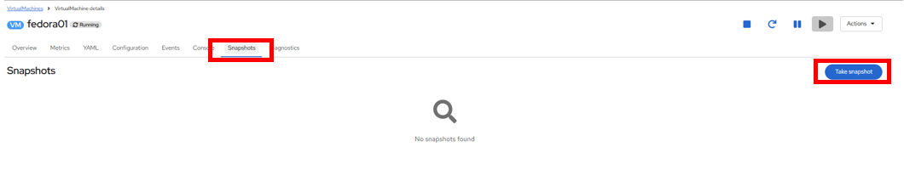{width="6.268055555555556in"
height="1.3006944444444444in"}

4.  Press Take snapshot and a dialog will open.

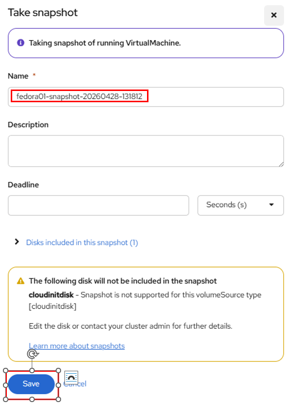{width="6.268055555555556in"
height="8.592361111111112in"}

  -------------------------------------------------------------------------
     There is a warning about the cloudinitdisk not being included in the
     snapshot. This is expected and happens because it is an ephemeral disk
     used for inital boot.
  -- ----------------------------------------------------------------------

  -------------------------------------------------------------------------

5.  A name will be auto-generated for the Snapshot. Press Save and wait
    until the status shows as Operation complete.

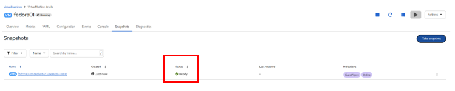{width="6.268055555555556in"
height="1.2548611111111112in"}

6.  Press the three-dot menu, and see that the Restore option is greyed
    out because the VM is currently running.

{width="6.268055555555556in"
height="7.473611111111111in"}

7.  Next, switch to the Console tab. We are going to login and perform a
    modification that prevents the VM from being able to boot.

{width="6.268055555555556in"
height="4.052083333333333in"}

  -------------------------------------------------------------------------
     There are copy icons next both the User name and Password and a Paste
     to console button available all available here, which makes the login
     process much easier.
  -- ----------------------------------------------------------------------

  -------------------------------------------------------------------------

8.  Once you are logged in, execute the following command:

sudo rm -rf /boot/grub2; sudo shutdown -r now

9.  Once executed, the virtual machine will automatically restart, but
    it will no longer be able to boot successfully.

{width="6.268055555555556in"
height="3.966666666666667in"}

  --------------------------------------------------------------------
     In the previous step, the operating system was shutdown from
     within the guest. However, OpenShift Virtualization will restart
     it automatically by default based on policy as the pod hosting
     the VM is still running. This behavior can be changed globally or
     on a per-VM basis.
  -- -----------------------------------------------------------------

  --------------------------------------------------------------------

10. Using the Actions dropdown menu or the shortcut button in the top
    right corner, Stop the VM. This process can take a long time since
    it attempts a graceful shutdown and the machine is in an unstable
    state. If you click on the Actions dropdown menu again you will have
    the option to Force stop. Please make use of this option in order to
    continue with the lab.

11. You can click on the Overview tab to confirm that the VM has
    stopped. You can also see the snapshot we recently took is now
    listed in the Snapshots tile.

12. On the Snapshots tile, click the three-dot menu next to our
    snapshot, and with the VM
    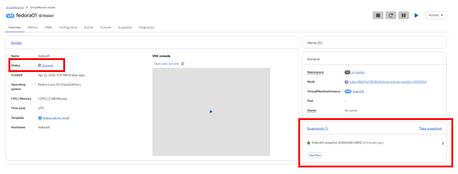{width="6.268055555555556in"
    height="2.3916666666666666in"}stopped, you will find Restore is no
    longer greyed out. Click it.

{width="6.268055555555556in"
height="2.4854166666666666in"}

13. In the dialog shown, press Restore.

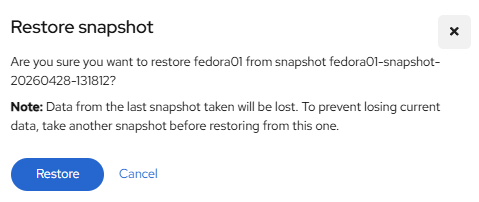{width="4.990279965004374in"
height="2.1044608486439196in"}

14. Wait until the VM is restored, the process should be fairly quick.
    If you click on the Snapshots tab at the top you can see details of
    the last restore operation.

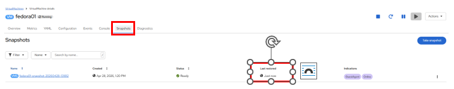{width="6.268055555555556in"
height="1.2270833333333333in"}

15. Return to Overview tab, and start the VM.

{width="6.268055555555556in"
height="3.421527777777778in"}

16. Click on the Console tab to confirm that the VM has now restarted
    and booted back up to the OS successfully.

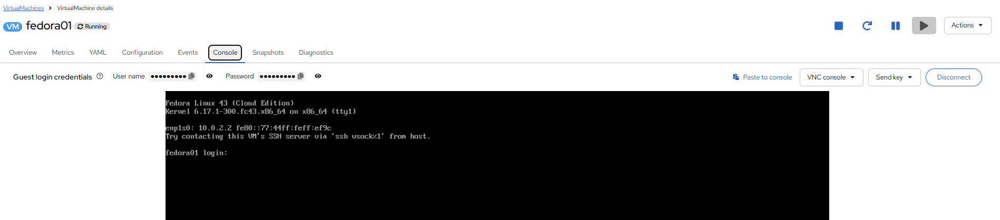{width="6.268055555555556in"
height="1.38125in"}

## Clone a Virtual Machine

Cloning creates a new VM that uses it's own disk image for storage, but
most of the clone's configuration and stored data is identical to the
source VM.

1.  Return to the Overview screen, and click the Actions dropdown menu
    to see the option to clone the VM.

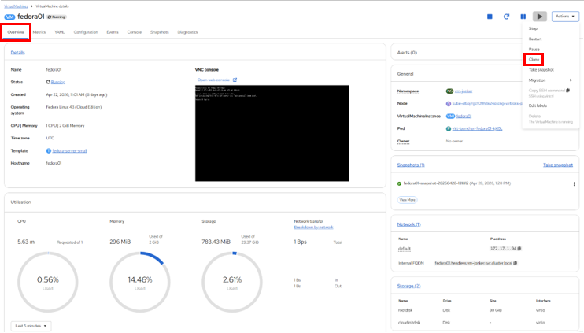{width="6.268055555555556in"
height="3.5729166666666665in"}

2.  Press Clone from the Actions menu, and a dialog will open. Name the
    cloned VM fedora02, and ensure that the checkbox to Start
    VirtualMachine on clone remains unchecked, then click Clone.

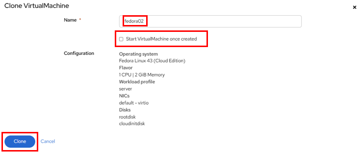{width="6.268055555555556in"
height="2.6638888888888888in"}

3.  A new VM is created, the disks are cloned and automatically the
    portal will redirect you to the new VM, and you can see
    the Created time as very recently.

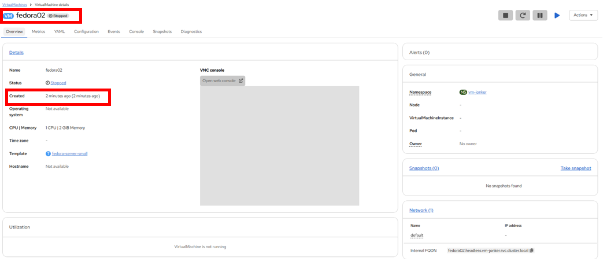{width="6.268055555555556in"
height="2.734027777777778in"}

  ------------------------------------------------------------------------
     The cloned VM will have the same identity as the source VM, which may
     cause conflicts with applications and other clients interacting with
     the VM. Use caution when cloning a VM connected to an external
     network or in the same project.
  -- ---------------------------------------------------------------------

  ------------------------------------------------------------------------

4.  Click on the YAML menu at the top of the screen, you will see that
    the name of the VM is fedora02, however there are some labels that
    remain from the fedora01 source VM that will need to be manually
    updated.

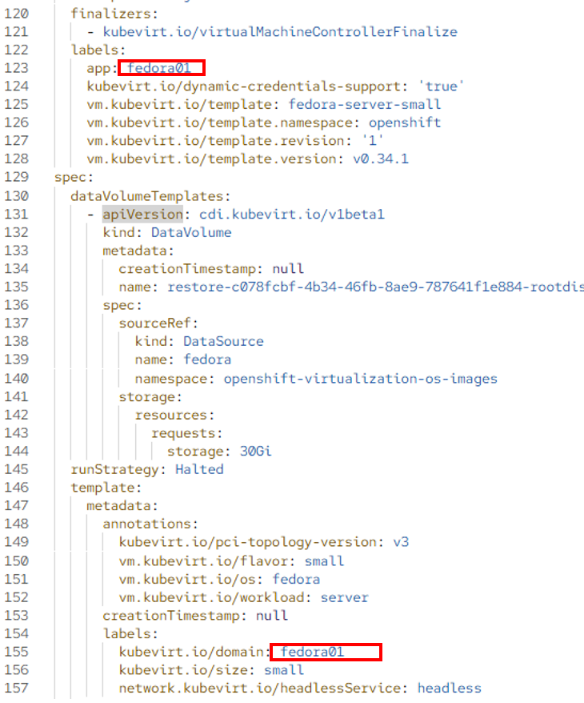{width="6.268055555555556in"
height="7.538888888888889in"}

------------------------------------------------------------------------

5.  Modify the the app and kubevirt.io/domain values in the YAML so that
    they are set to fedora02 then click the Save button at the bottom,
    you will prompted that fedora02 has been updated to a new version.
    Doing this now will allow us to avoid issues working with this VM in
    later modules.

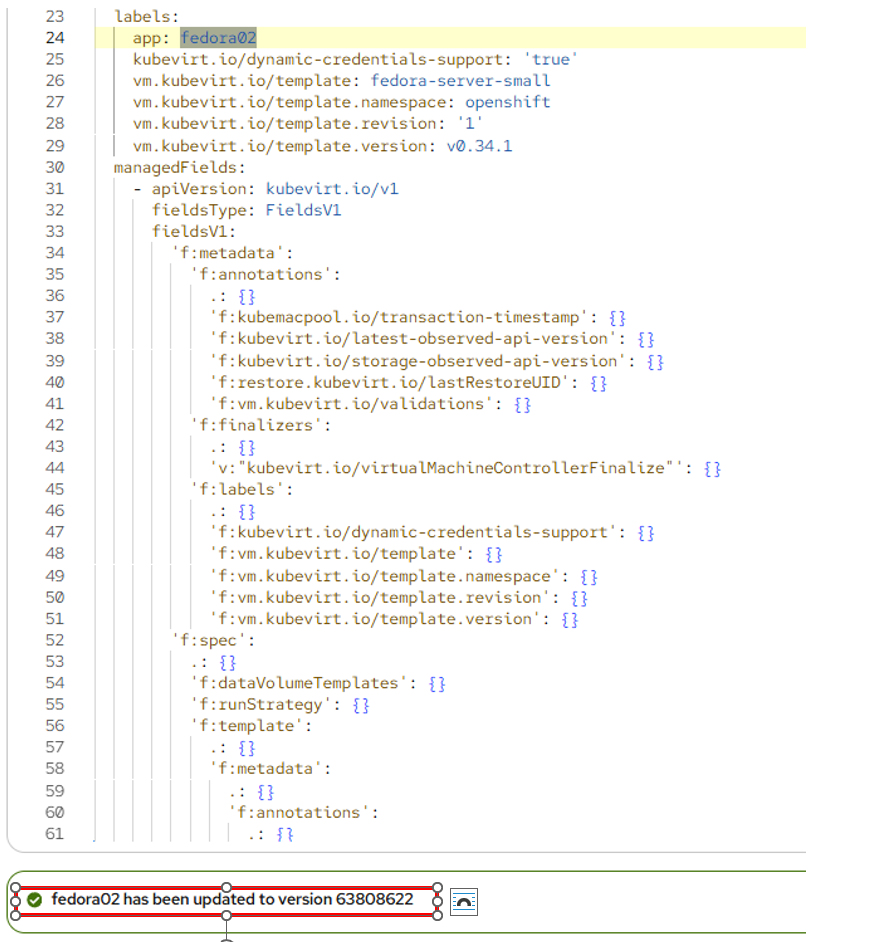{width="6.268055555555556in"
height="6.794444444444444in"}

6.  When you have completed the modifications to the virtual machine's
    YAML go ahead and start it up so that you have
    both fedora01 and fedora02 running.

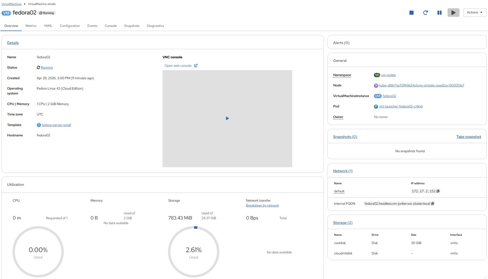{width="6.268055555555556in"
height="3.5902777777777777in"}

## Summary

In this section of our lab we explored the storage options that are
available when managing virtual machines. We also performed several VM
management functions that are dependant on the storage provisioned for
the virtual machine, including taking snapshots of VMs to peform basic
restores, and cloning of VMs to be used in other projects or to help
streamline future development.
