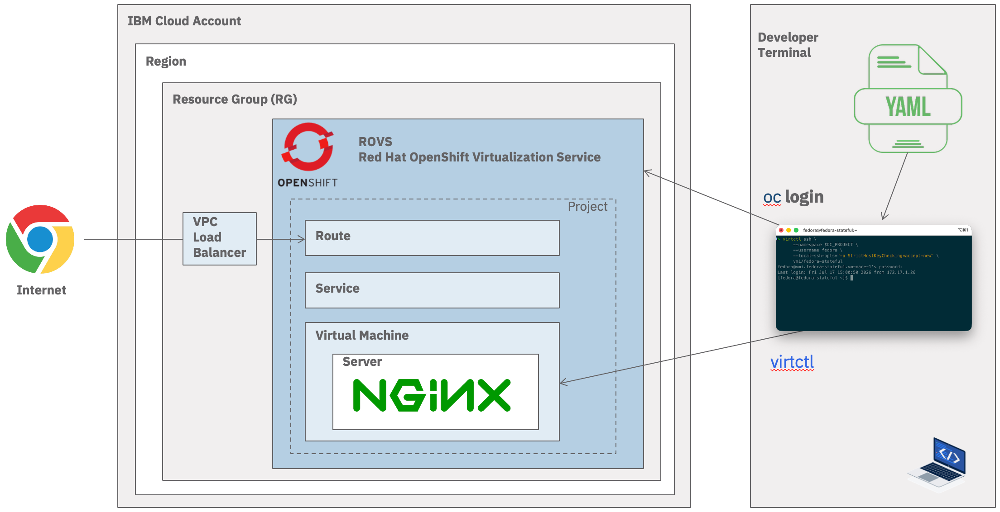
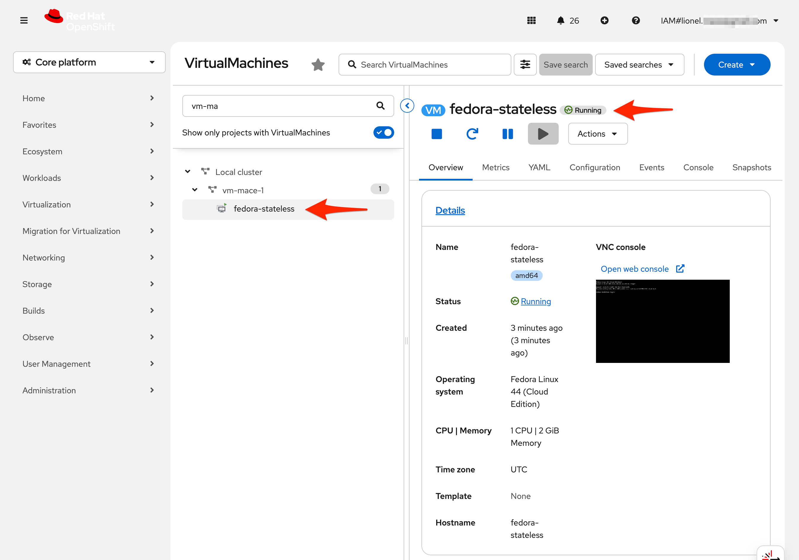

# Create and Manage VMs with YAML

> Estimated duration: 90 minutes

In this tutorial you will learn how to manage VMs using YAML files and the command lines `virtctl` and `oc`. You will deploy two types of VMs:

* a stateless VM with a ContainerDisk, which is ephemeral storage. The basic steps here would be to create a container image and use it as the root disk for the Virtual Machine. The OpenShift's internal registry is used to store the container image.
* a stateful the VM with Persistent Volumes (PVs).

You will deploy and expose the nginx server installed in the VM.



> This tutorial assumes you have access to an existing [ROVS cluster](https://cloud.ibm.com/infrastructure/openshift-virtualization).

## Agenda

* [Pre-Requisites](#pre-requisites)
* [Explore the existing golden images](#explore-the-existing-golden-images)
* [Provision a stateless VM](#provision-a-stateless-vm)
* [Provision a stateful VM](#provision-a-stateful-vm)
* [Access the VM via SSH](#access-the-vm-via-ssh)
* [Deploy NGinx on the VM and expose it as a public route](#deploy-nginx-on-the-vm-and-expose-it-as-a-public-route)
* [Import Image to the OpenShift Registry](#import-image-to-the-openshift-registry)

## Pre-Requisites

Make sure you have the command line tools below and you are connected to the cluster as described in the section [Connect to cluster](./00-connect-to-cluster.md).

* docker or podman
* virtctl
* OC (OpenShift) command line

## Explore the existing golden images

OpenShift Virtualization stores its automatically managed **golden images** in the `openshift-virtualization-os-images` namespace. Here is the list of [Certified Guest OS Operating Systems in OpenShift Virtualization](https://access.redhat.com/articles/4234591).

1. List all available operating-system boot sources:

    ```sh
    oc get datasource -n openshift-virtualization-os-images
    ```

1. Check the Fedora DataSource

    ```sh
    oc get datasource fedora \
      -n openshift-virtualization-os-images \
      -o yaml
    ```

    > The DataSource provides a stable name, while its underlying PVC can be updated when a newer Fedora boot image is imported.

## Provision a stateless VM

Let's provision a Fedora VM with a YAML file.

1. Let's set the environment variable for the OpenShift project

    ```sh
    export OC_PROJECT = <your-openshift-project>
    ```

    For example:

    ```sh
    export OC_PROJECT=vm-mace-1
    ```

1. Let's use this project

    ```sh
    oc project $OC_PROJECT
    ```

1. Provision a stateless Fedora VM

    ```sh
    cat <<EOF | oc apply -n $OC_PROJECT -f -
    apiVersion: kubevirt.io/v1
    kind: VirtualMachine
    metadata:
      name: fedora-stateless
      labels:
        app: fedora-stateless
    spec:
      runStrategy: Always # VM starts automatically and restarts if stopped
      template:
        spec:
          domain:
            cpu:
              cores: 1
              sockets: 1
              threads: 1
            devices:
              disks:
                - bootOrder: 1
                  disk:
                    bus: virtio
                  name: rootdisk
                - bootOrder: 4
                  disk:
                    bus: virtio
                  name: cloudinitdisk
              interfaces:
                - bootOrder: 2
                  masquerade: {}
                  model: virtio
                  name: nic0
              networkInterfaceMultiqueue: true
              rng: {}
            resources:
              requests:
                memory: 2Gi
          evictionStrategy: LiveMigrate
          hostname: fedora-stateless
          networks:
            - name: nic0
              pod: {}
          terminationGracePeriodSeconds: 0
          volumes:
            - name: rootdisk
              containerDisk:
                image: quay.io/containerdisks/fedora:latest
                imagePullPolicy: Always

            - name: cloudinitdisk
              cloudInitNoCloud:
                userData: |
                  #cloud-config
                  user: fedora
                  password: password
                  chpasswd:
                    expire: false
                  ssh_pwauth: true
                  hostname: fedora-stateless
    EOF
    ```

    > The VM should start within a minute.

1. List of VM in this project

    ```sh
    oc get vmi -n $OC_PROJECT
    ```

    > You should see

    ```sh
    NAME                      AGE     PHASE     IP             NODENAME                                                READY
    fedora-stateless          2m12s   Running   172.17.1.221   kube-d8ufsksf04cd0s5gpp90-sharedrovs-default-00000693   True
    ```

1. List of events on a specific VM. This command is useful should you have any issues on the VM

    ```sh
    oc describe vmi fedora-stateless -n $OC_PROJECT
    ```

    > You should see

    ```sh
    Events:
    Type    Reason            Age   From                       Message
    ----    ------            ----  ----                       -------
    Normal  SuccessfulCreate  60s   virtualmachine-controller  Created virtual machine pod virt-launcher-fedora-stateless-v78m7
    Normal  Created           48s   virt-handler               VirtualMachineInstance defined.
    Normal  Started           48s   virt-handler               VirtualMachineInstance started.
    ```

1. Connect to VM via virctl console. Login with credentials as **Login:** `fedora` **Password:** `password`

    ```sh
    virtctl console fedora-stateless -n $OC_PROJECT
    ```

1. Navigate to Openshift Console → Virtualization → VirtualMachines.

1. Notice the new Virtual Machine been created and in Running state.

    

1. You can also open the VNC console.

## Provision a stateful VM

Let's now provision a stateful VM. OpenShift Data Foundation (ODF) is installed in the ROVS cluster and it is recommend to use the storage class provided by ODF.

1. Retrieve and store the StorageClass name in a variable

    ```sh
    oc get sc
    ```

1. You will see several storage classes returned by the command above. Let's use the storage class optimized for OpenShift Virtualization provided by ODF. Ceph RBD supports ReadWriteMany when used as a raw block device.

    ```sh
    export STORAGE_CLASS_NAME=ocs-storagecluster-ceph-rbd-virtualization
    ```

1. Apply the VirtualMachine manifest.

    ```sh
    cat <<EOF | oc apply -n "$OC_PROJECT" -f -
    apiVersion: kubevirt.io/v1
    kind: VirtualMachine
    metadata:
      name: fedora-stateful
      labels:
        app: fedora-stateful
    spec:
      runStrategy: Always # VM starts automatically and restarts if stopped
      
      dataVolumeTemplates:
        - apiVersion: cdi.kubevirt.io/v1
          kind: DataVolume
          metadata:
            name: fedora-stateful-disk-0
          spec:
            storage:
              accessModes:
                - ReadWriteMany
              volumeMode: Block
              resources:
                requests:
                  storage: 50Gi
              storageClassName: $STORAGE_CLASS_NAME
            source:
              registry:
                url: docker://quay.io/containerdisks/fedora:latest
      
      template:
        metadata:
          labels:
            kubevirt.io/vm: vm-datavolume
        spec:
          domain:
            cpu:
              cores: 1
              sockets: 1
              threads: 1
            devices:
              disks:
                - bootOrder: 1
                  disk:
                    bus: virtio
                  name: disk-0
                - disk:
                    bus: virtio
                  name: cloudinitdisk
              interfaces:
                - bootOrder: 2
                  masquerade: {}
                  model: virtio
                  name: nic0
              networkInterfaceMultiqueue: true
              rng: {}
            resources:
              requests:
                memory: 2Gi
          
          evictionStrategy: LiveMigrate
          hostname: fedora-stateful
          
          networks:
            - name: nic0
              pod: {}
          
          terminationGracePeriodSeconds: 0
          
          volumes:
            - name: disk-0
              dataVolume:
                name: fedora-stateful-disk-0

            - name: cloudinitdisk
              cloudInitNoCloud:
                userData: |
                  #cloud-config
                  user: fedora
                  password: password
                  chpasswd:
                    expire: false
                  ssh_pwauth: true
                  hostname: fedora-stateful
    EOF
    ```

1. The DataVolume imports the disk into a PVC, so changes made inside the VM persist after the VMI is recreated. Let's check the bound pvc

    ```sh
    oc get pvc -n "$OC_PROJECT" -w
    ```

    Output:

    ```sh
    NAME                     STATUS   VOLUME                                     CAPACITY   ACCESS MODES   STORAGECLASS                                 VOLUMEATTRIBUTESCLASS   AGE
    fedora-stateful-disk-0   Bound    pvc-2e5c1498-e8a1-4bea-a171-5134675bc45d   50Gi       RWO            ocs-storagecluster-ceph-rbd-virtualization   <unset>                 99s
    ```

1. List the VM instance in this project. You will notice that the VM goes from the step `Scheduling` to `Running`.

    ```sh
    oc get vmi -n $OC_PROJECT
    ```

    > You should see

    ```sh
    NAME              AGE   PHASE     IP             NODENAME                                                READY
    fedora-stateful   13s   Running   172.17.1.232   kube-d8ufsksf04cd0s5gpp90-sharedrovs-default-00000693   True
    ```

1. List the Virtual Machines

    ```sh
    oc get vms
    ```

    Output

    ```sh
    NAME            AGE     VOLUME
    fedora-stateful   9m23s
    ```

Congratulations! You now have a running stateful VM.

## Access the VM via SSH

Let's access the VM via SSH. To do so, we will create a Kubernetes Secret containing the cloud-init configuration that will be applied when the VM boots for the first time. The Secret creates the `fedora` user, configures SSH key-based authentication, grants passwordless `sudo` access, and sets the VM hostname. Referencing a Secret from the VM manifest keeps credentials and initialization data separate from the VM definition.

1. Store the SSH Key in an environment variable.

    ```sh
    export SSH_KEY=$(cat ~/.ssh/id_rsa.pub)
    ```

1. Create a Secret that contains the cloud-init userData with SSH key

    ```sh
    cat <<EOF | oc apply -f -
    apiVersion: v1
    kind: Secret
    metadata:
      name: fedora-cloudinit-secret
      namespace: $OC_PROJECT
    type: Opaque
    stringData:
      userData: |
        #cloud-config
        ssh_pwauth: false         # disable SSH password login
        users:
          - name: fedora          # or any user you want
            gecos: Fedora User
            groups: [wheel]
            sudo: ALL=(ALL) NOPASSWD:ALL
            shell: /bin/bash
            ssh_authorized_keys:
              - $SSH_KEY
        hostname: fedora-stateful
    EOF
    ```

1. Provision a Stateful VM with a SSH key in a Secret

    ```sh
    cat <<EOF | oc apply -n "$OC_PROJECT" -f -
    apiVersion: kubevirt.io/v1
    kind: VirtualMachine
    metadata:
      name: fedora-stateful
      labels:
        app: fedora-stateful
    spec:
      runStrategy: Always # VM starts automatically and restarts if stopped

      dataVolumeTemplates:
        - apiVersion: cdi.kubevirt.io/v1
          kind: DataVolume
          metadata:
            name: fedora-stateful-disk-0
          spec:
            storage:
              accessModes:
                - ReadWriteMany
              volumeMode: Block
              resources:
                requests:
                  storage: 50Gi
              storageClassName: ${STORAGE_CLASS_NAME}
            source:
              registry:
                url: docker://quay.io/containerdisks/fedora:latest

      template:
        metadata:
          labels:
            kubevirt.io/vm: fedora-stateful
        spec:
          domain:
            cpu:
              cores: 1
              sockets: 1
              threads: 1
            devices:
              disks:
                - name: disk-0
                  bootOrder: 1
                  disk:
                    bus: virtio
                - name: cloudinitdisk
                  disk:
                    bus: virtio
              interfaces:
                - name: nic0
                  bootOrder: 2
                  masquerade: {}
                  model: virtio
              networkInterfaceMultiqueue: true
              rng: {}
            resources:
              requests:
                memory: 2Gi

          evictionStrategy: LiveMigrate
          hostname: fedora-stateful

          networks:
            - name: nic0
              pod: {}

          terminationGracePeriodSeconds: 0

          volumes:
            - name: disk-0
              dataVolume:
                name: fedora-stateful-disk-0

            - name: cloudinitdisk
              cloudInitNoCloud:
                secretRef:
                  name: fedora-cloudinit-secret
    EOF
    ```

    > Note: as we kept the same VM name, doing an apply will modify the existing stateful VM if you haven't deleted in the previous step
    virtualmachine.kubevirt.io/fedora-stateful configured

1. Connect to the VM with virtctl and the password

    ```sh
    virtctl ssh \
      --namespace $OC_PROJECT \
      --username fedora \
      --local-ssh-opts="-o StrictHostKeyChecking=accept-new" \
      vmi/fedora-stateful
    ```

Congratulations! You have been able to connect to your VM via SSH.

## Deploy NGINX on the VM and expose it as a public Route

Let's deploy an NGINX reverse proxy on the VM and expose it to be able to consume from the Internet.

1. Let's reconnect via SSH into the VM unless you're still connected.

1. Inside the VM, become root

    ```sh
    sudo -i
    ```

1. Update packages (optional but recommended)

    ```sh
    dnf -y update
    ```

1. Install nginx

    ```sh
    dnf -y install nginx
    ```

1. Enable and start nginx

    ```sh
    systemctl enable nginx
    systemctl start nginx
    systemctl status nginx
    ```

1. You should see it active (running) and listening on port 80:

    ```sh
    ss -tulnp | grep nginx
    ```

1. Simplify the web page

    ```sh
    cat >/usr/share/nginx/html/index.html <<'EOF'
    <html>
      <head><title>Fedora VM - Nginx</title></head>
      <body>
        <h1>Hello from nginx in a Fedora VM on OpenShift Virtualization!</h1>
      </body>
    </html>
    EOF
    ```

1. Exit from the VM.

    ```sh
    exit
    ```

1. Deploy a Service

    ```sh
    cat <<EOF | oc apply -f -
    apiVersion: v1
    kind: Service
    metadata:
      name: fedora-web
      namespace: $OC_PROJECT
    spec:
      selector:
        vm.kubevirt.io/name: fedora-stateful
      ports:
        - name: http
          port: 80        # Service port
          targetPort: 80  # nginx port in the VM
    EOF
    ```

1. Retrieve and store the ingress domain of the cluster

    ```sh
    export CLUSTER_NAME=shared-rovs
    export INGRESS_URL=$(ibmcloud ks cluster get --cluster $CLUSTER_NAME --json | jq -r .ingress.hostname)
    export INGRESS_SECRET=$(ibmcloud ks cluster get --cluster $CLUSTER_NAME --json | jq -r .ingress.secretName)
    echo $INGRESS_URL
    echo $INGRESS_SECRET
    ```

    > You should look something like this
    shared-rovs-5348c99e82c5c6b8edeec6aa250d032f-0000.eu-de.containers.appdomain.cloud

1. Create a Route

    ```sh
    cat <<EOF | oc apply -f -
    apiVersion: route.openshift.io/v1
    kind: Route
    metadata:
      name: fedora-web-route
      namespace: $OC_PROJECT
      labels:
        app: hello
        tier: frontend
    spec:
      host: $INGRESS_URL
      secretName: $INGRESS_SECRET
      to:
        kind: Service
        name: fedora-web
        weight: 100
      port:
        targetPort: 80
      tls:
        termination: edge
      wildcardPolicy: None
    EOF
    ```

1. Test the route

    ```sh
    curl https://$INGRESS_URL
    ```

1. You should see the following output

    ```html
    <html>
      <head><title>Fedora VM - Nginx</title></head>
      <body>
        <h1>Hello from nginx in a Fedora VM on OpenShift!</h1>
      </body>
    </html>
    ```

Congratulations! You now have a NGINX server running on OpenShift Virtualization exposed via a native public OpenShift Route.

## Clean up the VM

1. Delete the Virtual Machines

    ```sh
    oc delete vm/fedora-stateless
    oc delete vm/fedora-stateful
    ```
