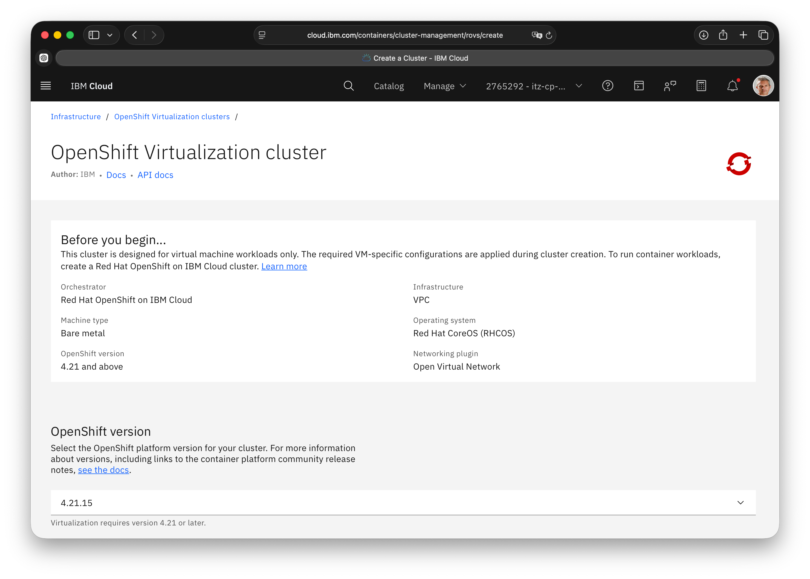

# ROVS Tutorials

Red Hat OpenShift Virtualization Service (ROVS) on IBM Cloud enables organizations to run virtual machines and containers on a single, unified platform. These tutorials provide step-by-step guidance to help you deploy, migrate, and network virtual workloads while leveraging the scalability, security, and operational consistency of OpenShift.

> In order to run this tutorial, you need to be invited to a ROVS cluster or provision one using the provided terraform scripts. Provisioning this infrastructure may incur cost.

You will find the below tutorials:

## Tutorial 1 – Virtual Machine Management

Managing virtual machines is one of the core responsibilities of a virtualization administrator. In this lab, you will become familiar with the OpenShift Virtualization management interface and perform essential day-to-day VM operations. You will learn how to manage VM power states, monitor workloads, and perform live migrations between physical hosts, building a solid foundation for administering virtualized workloads in OpenShift.
[VM management tutorial]([https://github.com/ibm-cloud-assets/rovs-tutorial/blob/main/docs/04-Networking%20Management%20for%20Virtual%20Machines%20(2).md](https://github.com/ibm-cloud-assets/rovs-tutorial/blob/main/docs/01-vm-management.md))

## Tutorial 2 – Storage Management

Storage is a fundamental component of virtual machine management. In this lab, you will explore the storage capabilities of OpenShift Virtualization, including persistent storage, snapshots, restores, and cloning. These features help protect workloads, simplify VM lifecycle management, and enable rapid provisioning of new environments.
[Storage management tutorial]([https://github.com/ibm-cloud-assets/rovs-tutorial/blob/main/docs/04-Networking%20Management%20for%20Virtual%20Machines%20(2).md](https://github.com/ibm-cloud-assets/rovs-tutorial/blob/main/docs/02-storage-management.md))

## Tutorial 3 – Template and InstanceType Management

Templates and InstanceTypes provide a standardized and efficient way to deploy virtual machines in OpenShift Virtualization. In this lab, you will learn how to customize VM templates for specific workloads, automate operating system deployments, and use InstanceTypes to define reusable compute configurations, enabling faster, more consistent, and cloud-like VM provisioning.
[Template management tutorial]([https://github.com/ibm-cloud-assets/rovs-tutorial/blob/main/docs/04-Networking%20Management%20for%20Virtual%20Machines%20(2).md](https://github.com/ibm-cloud-assets/rovs-tutorial/blob/main/docs/03-template-and-instancetype.md))

## Tutorial 4 - Networking Management for VMs

This tutorial demonstrates how to deploy and manage a virtual machine on Red Hat OpenShift Virtualization using a localnet. In this lab, you will become familiar with the OpenShift Virtualization management interface and learn how to configure networking for the Virtual Machine.
[Networking management tutorial](https://github.com/ibm-cloud-assets/rovs-tutorial/blob/main/docs/04-Networking%20Management%20for%20Virtual%20Machines%20(2).md)

## Tutorial 5 – Create and Manage VMs with YAML

This tutorial demonstrates how to deploy and manage a virtual machine on Red Hat OpenShift Virtualization using a YAML manifest. You'll learn how to define the VM's compute, storage, networking, and cloud-init configuration, then create and manage it directly with the oc and virtctl CLIs. Using YAML provides a repeatable, GitOps-friendly approach that is ideal for automation and Infrastructure as Code workflows.
[Yaml tutorial](https://[github.com/ibm-cloud-assets/rovs-tutorial/blob/main/docs/04-Networking%20Management%20for%20Virtual%20Machines%20(2).md](https://github.com/ibm-cloud-assets/rovs-tutorial/blob/main/docs/05-vm-yaml-import.md))
